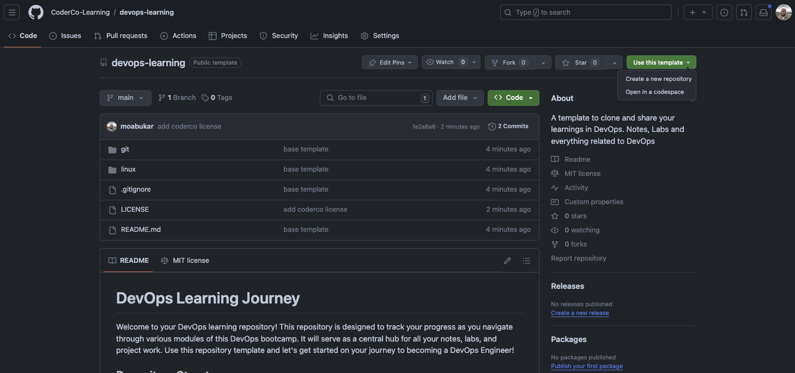
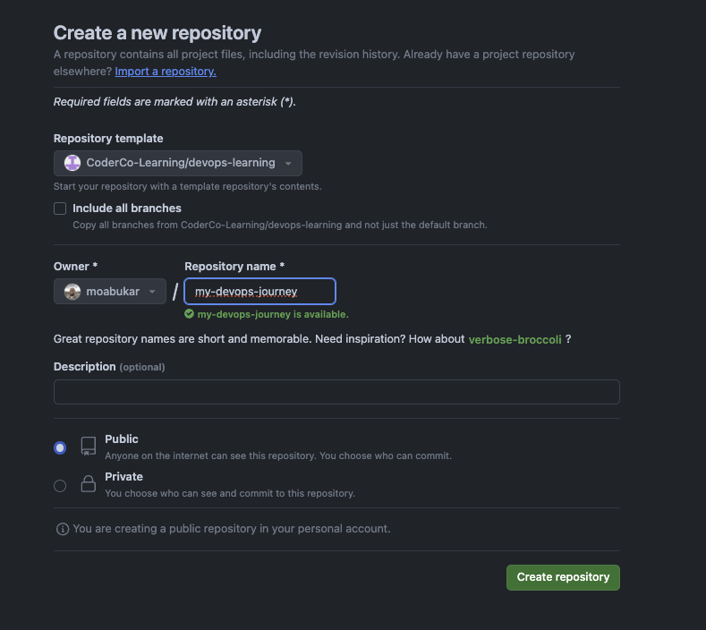

# DevOps Learning Journey

Welcome to your DevOps learning repository! This repository is designed to track your progress as you navigate through various modules of this DevOps bootcamp. It will serve as a central hub for all your notes, labs, and project work. Use this repository template and let's get started on your journey to becoming a DevOps Engineer!

## Initial setup


-------


## Repository Structure

This repository is organized into multiple modules, each representing a core area of DevOps. You will find a dedicated folder for each module where you can store your notes, labs, and any other relevant materials.

## Sample Directory Structure

Here's how your directory structure should look like as you progress through the bootcamp. This is an example of what your repository might look like after completing a few modules:

Example layout for repo only. Yours could be different but this is inspiration. 

```bash
devops-learning/
├── Linux/
│   ├── notes/
│   │   ├── linux-basics.md
│   │   ├── file-system.md
│   │   └── shell-scripting.md
│   ├── labs/
│   │   ├── lab1-basic-commands.md
│   │   ├── lab2-file-permissions.md
│   │   └── lab3-shell-scripting.md
│   └── projects/
│       ├── project1-custom-script/
│       │   ├── script.sh
│       │   └── README.md
│       └── project2-linux-server-setup/
│           ├── setup-notes.md
│           └── README.md
│
├── Git/
│   ├── notes/
│   │   ├── version-control-basics.md
│   │   ├── branching-and-merging.md
│   │   └── git-workflow.md
│   ├── labs/
│   │   ├── lab1-initial-commit.md
│   │   ├── lab2-branching.md
│   │   └── lab3-merge-conflicts.md
│   └── projects/
│       ├── project1-git-repo-setup/
│       │   ├── init-repo.sh
│       │   └── README.md
│       └── project2-collaboration-workflow/
│           ├── collaboration-notes.md
│           └── README.md
│
├── AWS/
│   ├── notes/
│   │   ├── aws-overview.md
│   │   ├── ec2-basics.md
│   │   └── s3-setup.md
│   ├── labs/
│   │   ├── lab1-ec2-instance.md
│   │   ├── lab2-s3-bucket.md
│   │   └── lab3-vpc-setup.md
│   └── projects/
│       ├── project1-hosting-on-ec2/
│       │   ├── deployment-notes.md
│       │   └── README.md
│       └── project2-static-website-on-s3/
│           ├── website-files/
│           └── README.md
│
├── Terraform/
│   ├── notes/
│   │   ├── terraform-basics.md
│   │   ├── providers-and-modules.md
│   │   └── state-management.md
│   ├── labs/
│   │   ├── lab1-terraform-setup.md
│   │   ├── lab2-infrastructure-as-code.md
│   │   └── lab3-terraform-modules.md
│   └── projects/
│       ├── project1-infrastructure-deployment/
│       │   ├── main.tf
│       │   ├── variables.tf
│       │   └── README.md
│       └── project2-multi-environment-setup/
│           ├── dev/
│           ├── prod/
│           └── README.md
│
└── README.md
```

### Modules

- **Linux:** Learn the basics and advanced concepts of Linux, the backbone of many DevOps tools.
- **Git:** Master version control using Git, a fundamental skill in DevOps.
- **AWS:** Dive into Amazon Web Services and learn how to manage cloud infrastructure.
- **Terraform:** Automate your infrastructure with Terraform, an Infrastructure as Code (IaC) tool.
- **Kubernetes:** Explore Kubernetes for container orchestration.
- **Docker:** Learn about containerization using Docker.
- **CI/CD:** Implement Continuous Integration and Continuous Deployment pipelines.
- **Networking:** Understand the fundamentals of networking and how it applies to DevOps.

## How to Use This Repository

- Make sure to have a GitHub account first
- Use the repo template and make your own repo from this into your GitHub Account
- Clone your repo locally and work on it.

## Best Practices

- Stay Organised: Keep your notes and labs organized in their respective module folders.
- Commit Often: Make regular commits to ensure you are tracking your progress effectively.

- Share Your Progress: Create LinkedIn posts about your journey and share your repository link. Don’t forget to tag @CoderCo!

- Ask for Help: If you get stuck, don't hesitate to reach out to the community or your mentors

## License

This repository is licensed under the MIT License. Feel free to use it as a template for your learning journey.

## Contact
For any questions or support, reach out to CoderCo or ask in our discussion forums.
